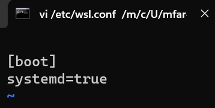

# Systemd support is now available in WSL!

__Di WSL sekarang sudah bisa pakai Systemd loh!__

Ditinjau dari [artikel ini],
sekarang kita cukup aktivasi **systemd** untuk dapat menggunakan docker package dari Linux.

  [artikel ini]: https://devblogs.microsoft.com/commandline/systemd-support-is-now-available-in-wsl/

<!-- more -->

_Artikel ini menjelaskan langkah-langkah untuk instalasi docker tanpa menggunakan **Docker Desktop** yang berat!
yaitu dengan mengaktivasikan **systemd** pada Linux_

## Quick start

For more detailed explanation, please refer to the [original article].

  [original article]: https://devblogs.microsoft.com/commandline/systemd-support-is-now-available-in-wsl/

### Set the systemd flag set in your WSL distro settings

You will need to edit the wsl.conf file to ensure systemd starts up on boot.

Add these lines to the `/etc/wsl.conf` (note you will need to run your editor with sudo privileges, e.g: `sudo nano /etc/wsl.conf`):

{ align=right }

``` markdown title="edited WSL configuration"
[boot]
systemd=true
```

<div class="result" markdown>

And close out of the nano editor using ++ctrl+o++ to save and ++ctrl+x++ to exit.

</div>

### Shutdown the WSL and validate the changes

With the above steps done, close your WSL distro Windows and run command below from **PowerShell** to restart your WSL instances.

```
wsl.exe --shutdown
```

Upon launch, you should have **systemd** running. You can check this with this command to show your services’ status:

```
systemctl list-unit-files --type=service
```

### Install `docker` in within Linux distro environment

In this section, we will short out the steps to install `docker`.
Please refer to the [docker official documentation] for the detailed instructions.

  [docker official documentation]: https://docs.docker.com/engine/install/ubuntu/

#### Install using the apt repository

Before you install Docker Engine for the first time on a new host machine,
you need to set up the Docker repository. Afterward, you can install and update Docker from the repository.

##### Set up Docker's apt repository.

```
# Add Docker's official GPG key:
sudo apt-get update
sudo apt-get install ca-certificates curl gnupg
sudo install -m 0755 -d /etc/apt/keyrings
curl -fsSL https://download.docker.com/linux/ubuntu/gpg | sudo gpg --dearmor -o /etc/apt/keyrings/docker.gpg
sudo chmod a+r /etc/apt/keyrings/docker.gpg

# Add the repository to Apt sources:
echo \
  "deb [arch=$(dpkg --print-architecture) signed-by=/etc/apt/keyrings/docker.gpg] https://download.docker.com/linux/ubuntu \
  $(. /etc/os-release && echo "$VERSION_CODENAME") stable" | \
  sudo tee /etc/apt/sources.list.d/docker.list > /dev/null
sudo apt-get update
```

##### Install the Docker packages.

```
sudo apt-get install docker-ce docker-ce-cli containerd.io docker-buildx-plugin docker-compose-plugin
```

##### Verify that the Docker Engine installation is successful by running the hello-world image.

```
sudo docker run hello-world
```

### Install `docker compose` in within Linux distro environment

In this section, we will short out the steps to install `docker-compose`.
Please refer to the [docker compose official documentation]
for the detailed instructions.

  [docker compose official documentation]: https://docs.docker.com/compose/install/linux/

#### Install using the apt repository (Ubuntu)

Update the package index, and install the latest version of Docker Compose:

```
sudo apt-get update
sudo apt-get install docker-compose-plugin
```

Verify that Docker Compose is installed correctly by checking the version.

```
docker compose version
```

Expected output:

```
Docker Compose version vN.N.N
```
Where `vN.N.N` is placeholder text standing in for the **latest version**.
