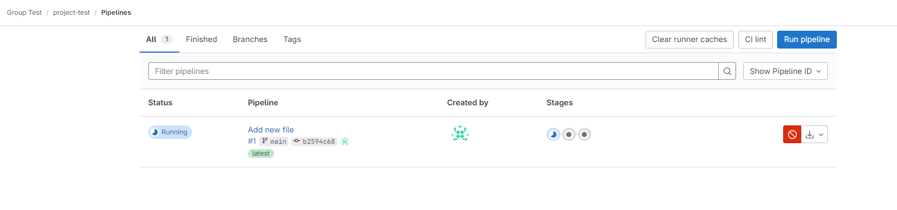

# Konfigurasi GitLab Runner

## Langkah 1: Konfigurasi GitLab Runner di GitLab

### **Akses Grup GitLab Anda**

   Kunjungi grup GitLab Anda di mana Anda ingin mengatur runner.

   

### **Menuju ke CI/CD Runners**

   Di dalam Grup, masuk ke Bagian Build -> Runners

   

### **Buat Group Runner Baru**

   1. Buka opsi dan pilih “`new group runner.`”

      

      Sesuaikan Pengaturan Runner:

   2. Pilih Sistem Operasi yang diinginkan (misalnya, `Linux`).

      

   3. Tambahkan tag yang akan Anda spesifikasikan dalam `.gitlab-ci.yml` Anda

   4. Tetapkan batas waktu maksimum (misalnya, `600 detik`)

      

   5. Klik "`Buat Runner`"

      

## Langkah 2: Daftarkan `Runner` Anda

  Sekarang, daftarkan runner Anda di mesin virtual menggunakan perintah berikut. Bersiaplah untuk memilih executor saat diminta, tergantung pada kebutuhan spesifik Anda.

  ```
  gitlab-runner register  --url https://gitlab.devops-tutorial.com  --token glrt-JAhFFWbcQyuYuAVJKLng
  ```

  

!!! tip

    (1) Pastikan _value_ `https://gitlab.devops-tutorial.com` diganti sesuai dengan
    nama domain yang sudah disiapkan. <br/>
    (2) _Value_ `glrt-JAhFFWbcQyuYuAVJKLng` didapatkan dari xxxx (TBD)

## Langkah 3: Restart GitLab Runner

### Restart GitLab Runner

   1. Setelah pendaftaran, restart GitLab Runner untuk menerapkan perubahan:

      ```
      sudo systemctl restart gitlab-runner
      ```

   2. Verifikasi Status Runner. Pastikan semuanya berjalan seperti yang diharapkan:

      ```
      sudo systemctl status gitlab-runner
      ```

      

## Langkah 4: Pengujian GitLab Runner

   1. Masuk ke Runner Grup, pastikan runner dalam kondisi online sehingga sudah siap digunakan:

      

   2. Lakukan pengujian untuk memastikan gitlab runner berjalan dengan baik.

      * Buat file bernama `.gitlab-ci.yml` dengan template dari "getting started"

        

      * Setelah itu, masuk ke pipelines dan pastikan runner sudah berjalan dengan baik.

        

      
