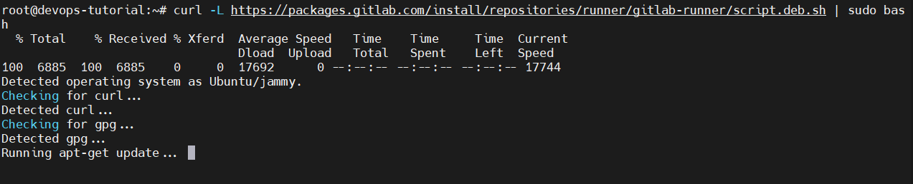
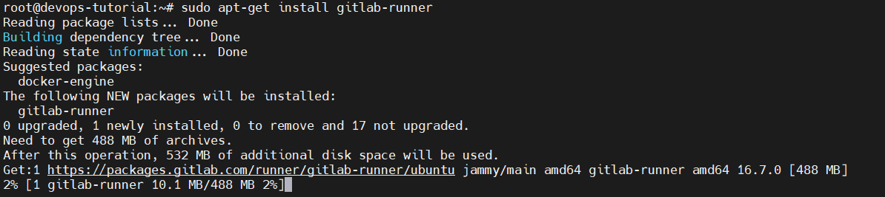
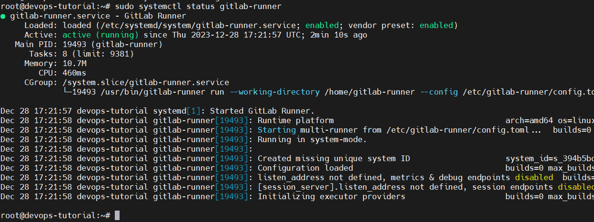

# Panduan Instalasi GitLab Runner

## Langkah 1: Buat Mesin Virtual

FYI: Menggunakan VPS

## Langkah 2: Instal GitLab Runner

   1. **Masuk dan Buka Terminal**

   2. **Jalankan Perintah Instalasi**
      1. Tambahkan repositori GitLab Runner

         ```
         curl -L https://packages.gitlab.com/install/repositories/runner/gitlab-runner/script.deb.sh | sudo bash
         ```

      

      2. Instal GitLab Runner

         ```
         sudo apt-get install gitlab-runner
         ```

      

## Langkah 3: Mulai GitLab Runner

   1. Jalankan Layanan GitLab Runner:

      ```
      sudo systemctl start gitlab-runner
      ```

   2. Periksa Status Runner:

      ```
      sudo systemctl status gitlab-runner
      ```

   
