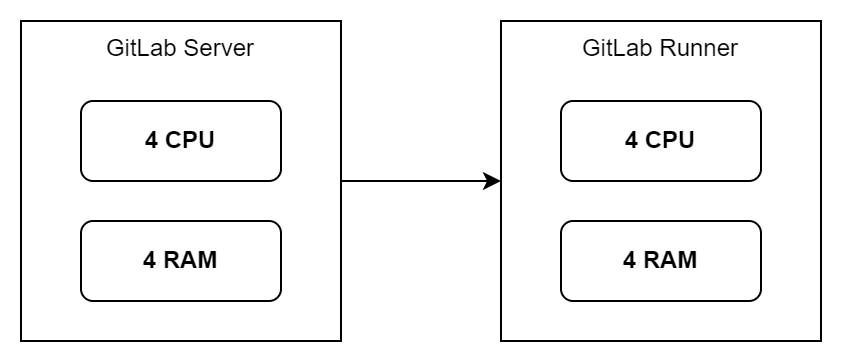

# GitLab: The self-hosted repository in SISMEDIKA

## Deployment architecture

Implementasi self-hosted GitLab membutuhkan 2 server, dimana satu server
akan berfungsi sebagai **Repository Server**, dan server satunya akan berfungsi
sebagai **Runner Server** untuk menjalankan CI/CD pipeline.

Detail **spesifikasi minimum** untuk kedua server dapat dilihat pada tabel dibawah ini:

| Jenis Server                 | Kebutuhan CPU | Kebutuhan CPU      |
|:-----------------------------|:--------------|:-------------------|
| **Repository Server**        | 4 CPU         | 4 RAM              |
| **Runner Server**            | 2 CPU         | 4 RAM              |

## Pros and Cons

Dalam solusi ini, pembagian server ditujukan agar:
* Lebih mudah dalam maintenance dan upgrading kebutuhan sistem.
* Memaksimalkan kinerja satu sama lain
* Tidak terjadi performance degradation bottleneck yang dikarenakan adanya actions yang bersamaan
  (karena kita memiliki banyak products)

## Documentation content

Details of the documentation for GitLab is divided into multiple sections as described below.

- :fontawesome-solid-earth-americas: __[Self-hosted Installation (Native)]__ – Steps to install GitLab Server in a standalone server (Native)
- :fontawesome-solid-earth-americas: __[Self-hosted Installation (Docker)]__ – Steps to install GitLab Server in a standalone server (Dockerized)
- :material-page-layout-sidebar-left: __[GitLab Runner Installation]__ – Steps to install GitLab Runner
- :material-page-layout-sidebar-left: __[GitLab Runner Configuration]__ – Steps to configure GitLab Runner

  [Self-hosted Installation (Native)]: install-self-hosted/native/native.md
  [Self-hosted Installation (Docker)]: install-self-hosted/docker/docker.md
  [GitLab Runner Installation]: gitlab-runner/install.md
  [GitLab Runner Configuration]: gitlab-runner/configuration.md
