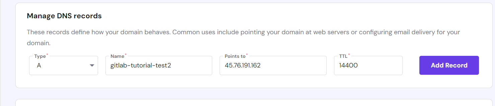

# Instalasi Gitlab Self-Managed (Native Install)

## Instal dan konfigurasikan dependensi
   - Perbarui paket:
     ```shell
     sudo apt-get update
     ```

     

   - Instal curl, sertifikat CA, dan tzdata:
     ```shell
     sudo apt-get install -y curl ca-certificates tzdata perl
     ```

     

## Instal `Postfix` **(Optional)**

   * Instal Postfix:
     ```shell
     sudo apt-get install -y postfix
     ```
   * Selama instalasi Postfix, layar konfigurasi mungkin muncul. Pilih 'Internet Site' dan tekan enter. Gunakan DNS eksternal server Anda untuk 'mail name' dan tekan enter. Jika layar tambahan muncul, terus tekan enter untuk menerima default.
   * Sebagai alternatif lain, kita juga bisa menggunakan [Sendmail].

  [Sendmail]: https://kenfavors.com/code/how-to-install-and-configure-sendmail-on-ubuntu/

!!! tip

    **Postfix** digunakan untuk mengirim email notifikasi. Jika ingin menggunakan solusi lain untuk mengirim email, lewati langkah ini dan konfigurasikan server SMTP eksternal setelah GitLab terinstal.

## Menyiapkan domain
   * Contoh domain: `gitlab.devops-tutorial.com`
   * Setelah domain disipakan, kita harus mengarahkannya ke IP publik server Gitlab. (FYI: Disini penulis menggunakan niagahoster untuk pengaturan DNS.)

   

## Konfigurasi `firewall`
   * Jalankan _command_ dibawah ini untuk mengizinkan beberapa koneksi agar bisa diakses dari luar.

   ```
   sudo ufw allow "OpenSSH"
   sudo ufw allow 80/tcp
   sudo ufw allow 443/tcp
   ```

   **Notes:**

   * `sudo ufw allow "OpenSSH"`:
      - Mengizinkan akses SSH untuk koneksi jarak jauh ke server.

   * `sudo ufw allow 80/tcp`:
      - Membuka port 80 untuk lalu lintas HTTP, digunakan untuk mengakses halaman web.

   * `sudo ufw allow 443/tcp`:
      - Membuka port 443 untuk lalu lintas HTTPS, digunakan untuk koneksi web yang aman.

## Tambahkan repositori paket GitLab dan instal paketnya.
   * Tambahkan repositori:
     ```shell
     curl https://packages.gitlab.com/install/repositories/gitlab/gitlab-ee/script.deb.sh | sudo bash
     ```

     

## Instalasi `gitlab-ee` package
   * Untuk URL `https://`, GitLab akan secara otomatis meminta sertifikat dengan [Let's Encrypt], yang memerlukan akses HTTP masuk dan hostname yang valid. Anda juga dapat menggunakan sertifikat Anda sendiri atau hanya menggunakan `http://` (tanpa `s`).
   * Instalasi gitlab-ee package `beserta EXTERNAL_URL` dengan command berikut:

     ```
     sudo EXTERNAL_URL="https://gitlab.example.com" apt-get install gitlab-ee
     ```

     `EXTERNAL_URL=` Menetapkan URL eksternal untuk instansi GitLab. Ini adalah URL yang akan digunakan pengguna untuk mengakses GitLab.

     

     Dalam proses instalasi, terkadang akan ditampilkan informasi untuk restart salah satu package. Tekan `OK` saja.
     

   [Let's Encrypt]: https://letsencrypt.org/

## Jelajahi gitlab domain
   * Contoh domain: `https://gitlab.example.com`
   * **username** default adalah `root`
   * Untuk **kata sandi**, Kecuali Anda menyediakan kata sandi kustom selama instalasi, kata sandi akan dihasilkan secara acak dan disimpan selama 24 jam di `/etc/gitlab/initial_root_password`. Gunakan kata sandi ini dengan nama pengguna root untuk login.
     ```shell
     cat /etc/gitlab/initial_root_password
     ```
   * Silahkan coba untuk login menggunakan kredensial diatas.

!!! tip

    Setelah login sukses, jangan lupa untuk mengganti **kata sandi** pada akun `root`.

## Instalasi selesai
   * Setelah login berhasil. Ini menandakan bahwa instalasi GitLab sudah selesai.

     
