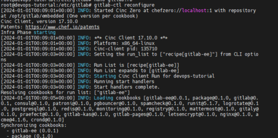

# Konfigurasi dan aktivasi SMTP

## Parameter SMTP
   * Untuk mengirim notifikasi via email, konfigurasikan SMTP di `gitlab.rb`:
     ```shell
     nano /etc/gitlab/gitlab.rb
     ```

   * Tambahkan potongan kode dibawah ini:
     ``` markdown title="file '/etc/gitlab/gitlab.rb'"
     # Aktifkan SMTP
     gitlab_rails['smtp_enable'] = true

     # Konfigurasi server SMTP
     gitlab_rails['smtp_address'] = "smtp.server"
     gitlab_rails['smtp_port'] = 465
     gitlab_rails['smtp_user_name'] = "smtp user"
     gitlab_rails['smtp_password'] = "smtp password"
     gitlab_rails['smtp_domain'] = "example.com"
     gitlab_rails['smtp_authentication'] = "login"
     gitlab_rails['smtp_enable_starttls_auto'] = true
     gitlab_rails['smtp_tls'] = false
     gitlab_rails['smtp_pool'] = false
     ```
   * Setelah selesai, simpan

!!! tip

    (1) Jangan lupa untuk ganti _value_ sesuai dengan konfigurasi SMTP anda.
    <br/>
    (2) Pastikan tidak ada duplikasi parameter `gitlab_rails` ya.

## Konfigurasi URL Container Registry
   * Lakukan edit lagi untuk konfigurasi gitlab pada file `gitlab.rb`:

     ```shell
     nano /etc/gitlab/gitlab.rb
     ```

   * Definisikan URL untuk container registry di `gitlab.rb`:

     ``` markdown title="file '/etc/gitlab/gitlab.rb'"
     # Atur URL eksternal untuk container registry
     registry_external_url 'https://gitlab.devops-tutorial.com'
     ```

   * Setelah selesai, simpan

## Rekonfigurasi GitLab

   * Setelah melakukan perubahan konfigurasi di `gitlab.rb`, jalankan perintah berikut untuk menerapkan konfigurasi:

     ```bash
     gitlab-ctl reconfigure
     ```

     
