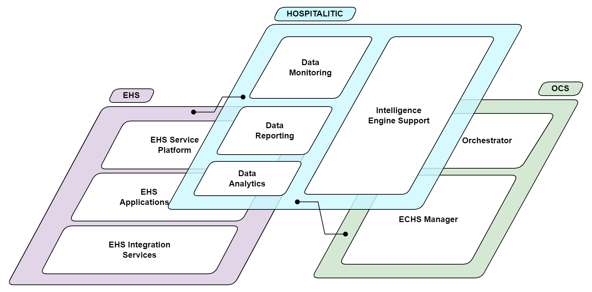

# Working Package 1.1: Initial system design

## Documentation property
| Method                     | Description                                              |
|:---------------------------|:---------------------------------------------------------|
| Documentation Author       | [Muhammad Febrian Ardiansyah](mailto:ardi@sismedika.com) |
| Documentation Last Updated | 30 December 2023                                         |

## Documentation history
| Revision                    | Date             | Updated by                                        | Description                                     |
|:----------------------------|:-----------------|:--------------------------------------------------|:------------------------------------------------|
| 0.1                         | 30 December 2023 | [Muhammad Febrian Ardiansyah](mailto:ardi@sismedika.com) | Added draft data from doc file created by Jafar |

## Abstract

## Document properties

TO BE DONE

## Document history

TO BE DONE

## Disclaimer

TO BE DONE

## Background

menjelaskan sistem HIS pada umumnya. ada module apa saja. bagaiamana sistem dari setiap
departemen itu terhubung

### Current product: Hospital Information System (HIS) version 2.0
menjelaskan kekurangan pada HIS.v2 (secara umum dan diberikan beberapa sample studi kasus)

## System Overview: HIS version 3.0

### Problem statement
menjelaskan dan hightlight masalah yang wajib untuk diselesaikan, dan rencana akan dikembangkan
di HISv3.

### Objectives
menjelaskan objective-nya

### General architecture
gambar dan menjelaskan grand design yang akan di propose.
gambar dgn semua layer. lalu dijelaskan satu-satu per layernya.

#### Database Layer
TBD
pakai vitess.io untuk sharding database

#### Application Layer
FE: reactjs -> framework apa ..
BE: golang -> ...

#### Data Transportation Layer
private+public key, https, http 1.0, SSL, dst

#### Monitoring Layer
visualization tools -> kibana/grafana

#### Reporting Layer
BIRT

#### 3rd Party Integration Layer
Satusehat, PCARE, in-health, dst

### Key technologies
menjelaskan Key technologies-nya
