# Scenario 1: Patient Management

Patient management in healthcare encompasses crucial functions. It commences with __[patient registration]__, during which the system gathers personal and medical information upon the patient's arrival at a healthcare facility. This information includes patient identity, demographics, symptoms, allergies, contact details, insurance, and the creation of a medical record. The system is also integrated with __[SatuSehat: IHS Number]__.

Once registered, patients __[can be monitored]__ until they are discharged. This monitoring involves tracking patient transactions and examination statuses, along with generating reports on __[lead times and patient discharges]__.

  [patient registration]: #sub-scenario-11-patient-registration-p1
  [can be monitored]: #sub-scenario-12-patient-tracking-and-discharge-p2
  [lead times and patient discharges]: #sub-scenario-13-patient-discharge-lead-time-reporting-system-p3
  [SatuSehat: IHS Number]: #

: !!! Info "Sub-Scenario List"

        1. [Sub-Scenario 1.1: Patient Registration (P1)](#sub-scenario-11-patient-registration-p1)
        2. [Sub-Scenario 1.2: Patient Tracking and Discharge (P2)](#sub-scenario-12-patient-tracking-and-discharge-p2)
        3. [Sub-Scenario 1.3: Patient Discharge Lead Time Reporting System (P3)](#sub-scenario-13-patient-discharge-lead-time-reporting-system-p3)

## Sub-Scenario 1.1: Patient Registration (P1)

[:octicons-arrow-right-24: PRD - Patient Registration](./../../../../prd/1-patient-care-information-system/prd-patient-registration.md){:target="_blank"}

Patient registration involves collecting essential information when a patient first arrives at a healthcare facility. During this process, we classify patient registration into these use cases:

: !!! Example "Use Case List"

        1. [Use Case 1: New Patient Registration](#use-case-1-new-patient-registration)
        2. [Use Case 2: Old Patient Registraiton](#use-case-2-old-patient-registration)
        3. [Use Case 3: New Born Registration](#use-case-3-new-born-registration)
        4. [Use Case 4: Patient X registration](#use-case-3-new-born-registration)
        5. [Use Case 5: Foreigner registration](#use-case-3-new-born-registration)

### Use Case 1: New Patient Registration

In this scenario, new patients can be accommodated using four methods: by using `IHS_ID`, `Medical Record`, `ID number`/NIK, and new registration form

#### Registration with `IHS_ID`

*The IHS_ID is an identification number provided to patients based on SatuSehat, aiming to standardize patient data across Indonesia.

Patients with an IHS_ID can be identified as individuals who have previously registered for healthcare services at a different healthcare facility (non-Primaya Group) and already have an IHS_ID. For these patients, the registration process simply requires them to show their ID card number (NIK), and the system will automatically retrieve their IHS_ID, filling out the registration form accordingly.

On the other hand, patients without an IHS_ID are those who have never sought medical treatment at any healthcare facility before. Therefore, they need to complete a new registration by providing the required information.

After successfully creating the patient's data, the patient will receive a **Medical Record**.

##### Use Cases Diagram
:green_book:{ title="desain UI/UX sudah selesai" } :mango:{ title="feature development belum diujicoba" }

<figure markdown>
  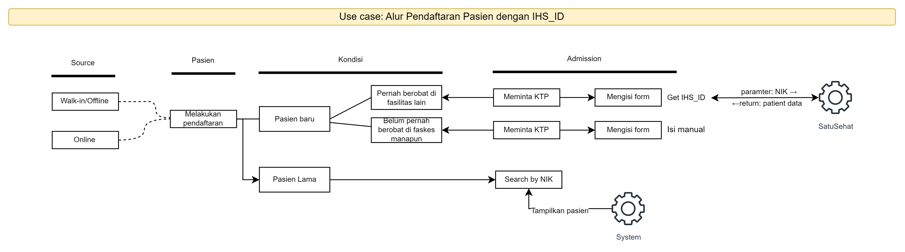{ width="600" }
  <figcaption>New Patient Registration (Offline-Admission)</figcaption>
</figure>

[:octicons-arrow-right-24: New Patient Registration (Offline-Admission)](https://drive.google.com/file/d/1dut69YOdrAE-vR0XN53jHkMJ9V8sVhwh/view?usp=sharing){:target="_blank"}

Other useful resources:

| Flow   | Link                  |
| ----------- | ------------------------------------ |
| New patient registration flow     | [:octicons-arrow-right-24: Click here](https://drive.google.com/file/d/12K8knuOoSgAHs0Bt0iPAhWVg-ByW9A9w/view?usp=sharing){:target="_blank"} |
| Flow IHS ID cari di backend   | [:octicons-arrow-right-24: Click here](https://drive.google.com/file/d/1TVLYO6Qo-rPJCkfPjI14aasnTuQaOYOm/view?usp=sharing){:target="_blank"} |
| Get IHS ID SatuSehat     | [:octicons-arrow-right-24: Click here](https://drive.google.com/file/d/1dF2EheSFlsp-B9MCqffSxydAqVYQuIMP/view?usp=sharing){:target="_blank"} |
| Sequence Diagram SatuSehat IHS ID    | [:octicons-arrow-right-24: Click here](https://drive.google.com/file/d/1Wjx-YQzWJQ9sKgCmZhybT-T_fmGEfHMo/view?usp=sharing){:target="_blank"} |

#### Search patient with `Medical Record`

Below is the use case of search patient with `Medical Record`

##### Use Cases Diagram
:green_book:{ title="desain UI/UX sudah selesai" } :mango:{ title="feature development belum diujicoba" }

<figure markdown>
  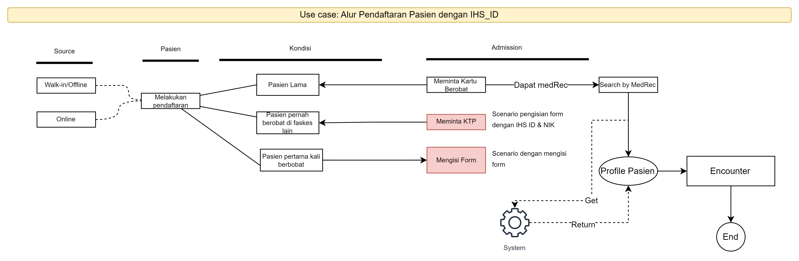{ width="600" }
  <figcaption>Search patient with Medical Record</figcaption>
</figure>

[:octicons-arrow-right-24: search by Medical Record](https://drive.google.com/file/d/1_2-XmaPYj8MN8vYuG9Y0mejazO-Ld16w/view?usp=sharing){:target="_blank"}

Other useful resources:

| Flow   | Link                  |
| ----------- | ------------------------------------ |
| Patient Registration Flow   | [:octicons-arrow-right-24: Click here](https://drive.google.com/file/d/15EcJZK6OrFXuZvrWLZGPdZEm8Xq_iDtY/view?google_abuse=GOOGLE_ABUSE_EXEMPTION%3DID%3De7aa6a9b4435c1ba:TM%3D1705306336:C%3Dr:IP%3D125.161.66.123-:S%3DzWjVR5J3GMUUdKABIS9NcCo%3B+path%3D/%3B+domain%3Dgoogle.com%3B+expires%3DMon,+15-Jan-2024+11:12:16+GMT){:target="_blank"} |
| Type of patient | [:octicons-arrow-right-24: Click here](https://drive.google.com/file/d/1LtbP8BWLmv4BWN3wm5iRpK81DcNBrZU4/view){:target="_blank"} |
| Search Patient| [:octicons-arrow-right-24: Click here](https://drive.google.com/file/d/1H_Ah01Za4IFafTa3msKQHeYoCW1ZOXnG/view){:target="_blank"} |

#### Registration with `Fill New Form`

Below is the user flow of new patient registration by filling the `Registration Form`

##### Use Cases Diagram
:green_book:{ title="desain UI/UX sudah selesai" } :mango:{ title="feature development belum diujicoba" }

<figure markdown>
  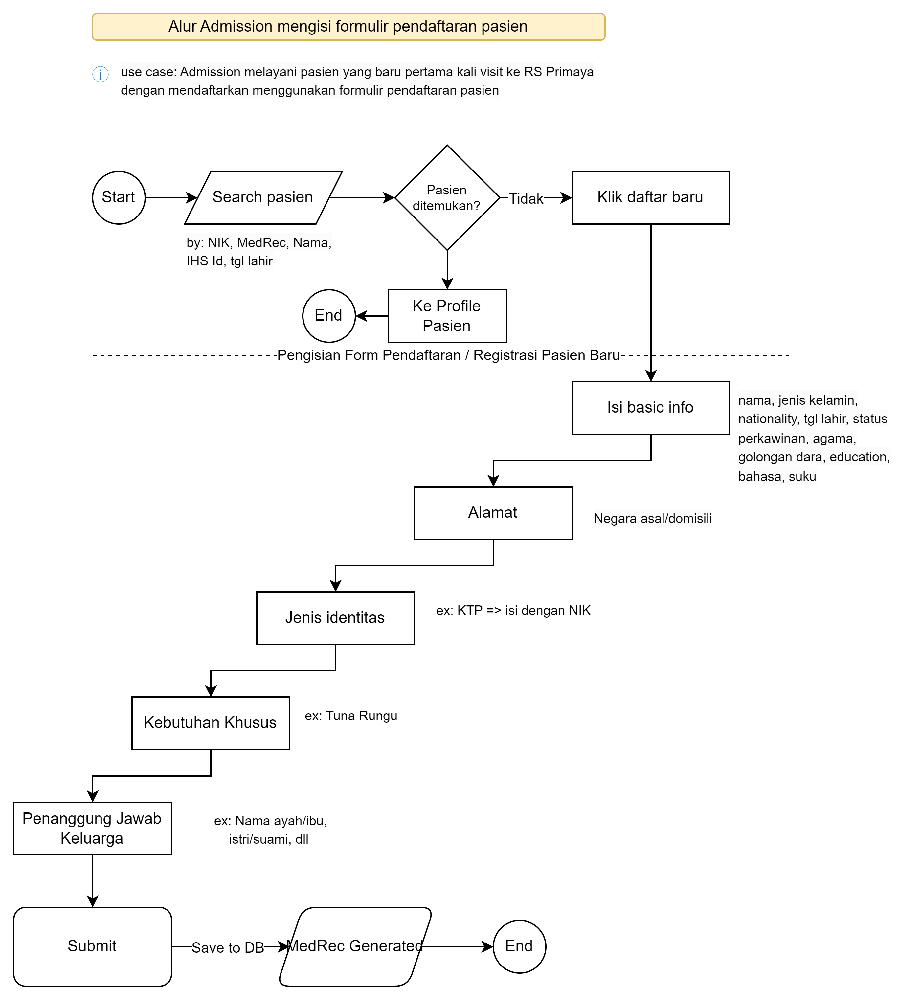{ width="600" }
  <figcaption>New Patient Registration (Offline-Admission)</figcaption>
</figure>

[:octicons-arrow-right-24: New Patient Registration with Registration Form](https://drive.google.com/file/d/1NnBKyyTRdPL0gqEvJ3RTb1XkcWUQ_qJ9/view?usp=sharing){:target="_blank"}

### Use Case 2: Old Patient
:green_book:{ title="desain UI/UX sudah selesai" } :mango:{ title="feature development belum diujicoba" }

An "Old Patient" refers to a patient who has previously registered at Primaya Hospital and already possesses a Medical Record. For subsequent visits, these patients only need to mention their Medical Record, which can then be used for the encounter.

For old patient there is no need to do registration. Just search by MedRec, then if found, go to [Encounter Process](sc-3-patient-encounter.md)

<figure markdown>
  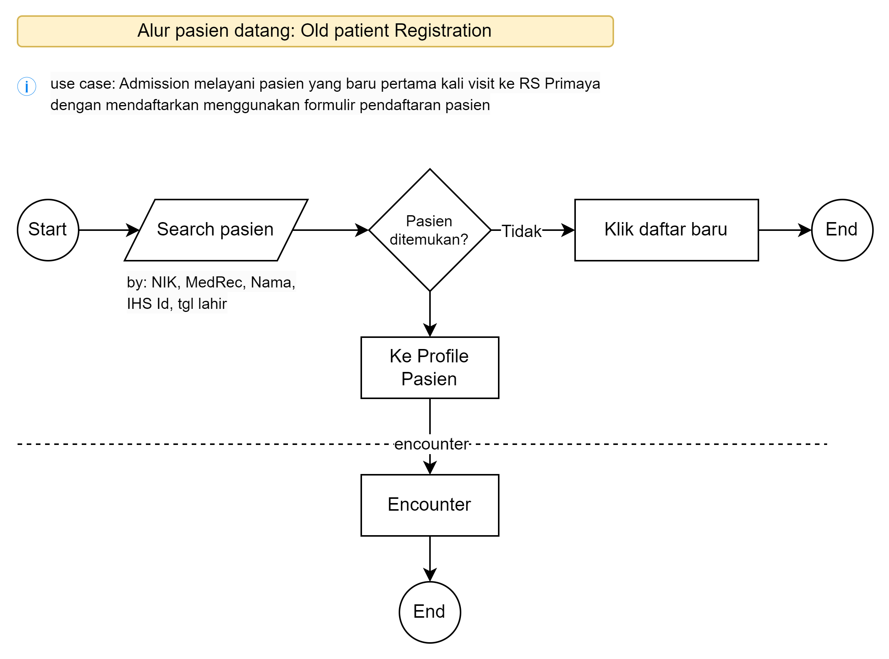{ width="600" }
  <figcaption>Old patient visit</figcaption>
</figure>

[:octicons-arrow-right-24: New Patient Registration with Registration Form](https://drive.google.com/file/d/1NnBKyyTRdPL0gqEvJ3RTb1XkcWUQ_qJ9/view?usp=sharing){:target="_blank"}

### Use Case 3: New Born Registration
:green_book:{ title="desain UI/UX sudah selesai" } :mango:{ title="feature development belum diujicoba" }

It's a scenario where the system accommodates the newborn registration.
The touchpoints could be initiated through [EMR module](sc-4-electronic-healthcare.md){:target="_blank"} and admission process.

We classify new born registration into these use cases:

: !!! Example "Use Cases List"

        1. [New born touch point Admission](#new-born-touch-point-admission-diagram)
        2. [New born touch point EMR](#new-born-touch-point-emr)
        3. [New Born Update data](#new-born-update-data)

##### New born touch point Admission Diagram
:green_book:{ title="desain UI/UX sudah selesai" } :mango:{ title="feature development belum diujicoba" }

<figure markdown>
  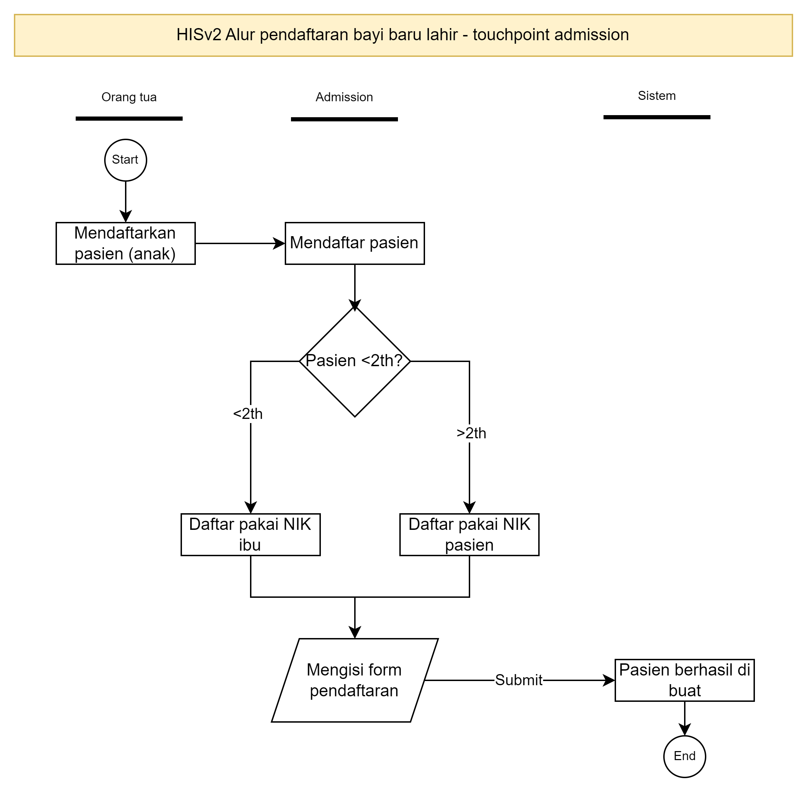{ width="600" }
  <figcaption>New born registration - touchpoint admission</figcaption>
</figure>

[:octicons-arrow-right-24: New born touch point Admission Diagram](https://drive.google.com/file/d/1fWtpY673BhcPATxqe4NBvp7X93cjlnmh/view){:target="_blank"}

##### New born touch point EMR
:green_book:{ title="desain UI/UX sudah selesai" } :mango:{ title="feature development belum diujicoba" }

<figure markdown>
  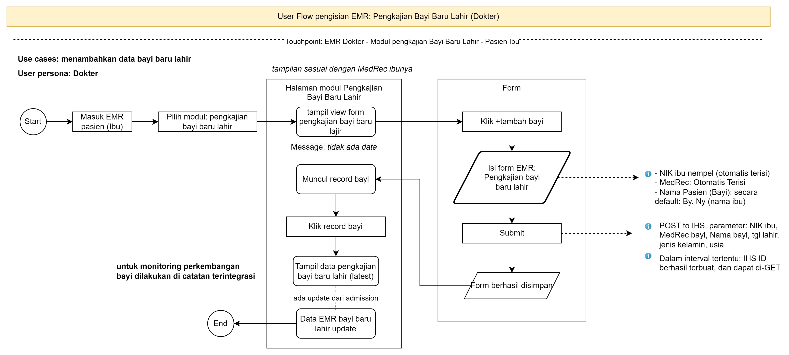
  <figcaption>New born registration - touchpoint EMR</figcaption>
</figure>

[:octicons-arrow-right-24: New born touch point Admission Diagram](https://drive.google.com/file/d/16LLGlyNeAXCOHDoSXEVcWFhriNlxQKh5/view){:target="_blank"}

##### New Born Update data
:closed_book:{ title="desain UI/UX belum selesai" } :mango:{ title="feature development belum diujicoba" }

<figure markdown>
  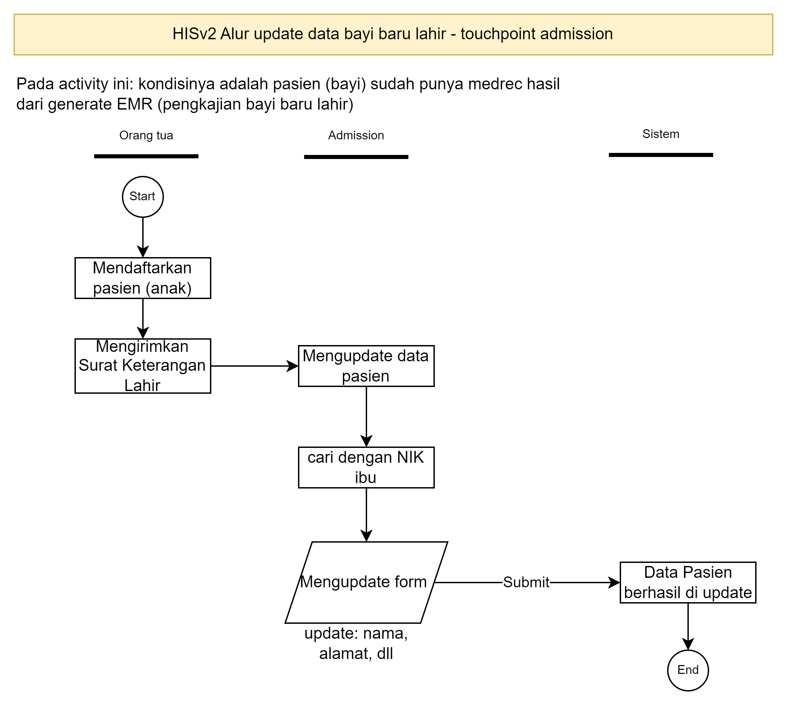{ width="600" }
  <figcaption>New born update data</figcaption>
</figure>

[:octicons-arrow-right-24: New Born Update data](https://drive.google.com/file/d/1hflUJrUO8F3UPVgbp9aK-3vywichPqOD/view){:target="_blank"}

#### Patient new born registration (mother have IHS ID and child doesn't have IHS ID)
:green_book:{ title="desain UI/UX sudah selesai" } :mango:{ title="feature development belum diujicoba" }
{==

TODO: ADD DIAGRAM HERE

==}

#### Patient new born registration (both mother and child have IHS ID)
:green_book:{ title="desain UI/UX sudah selesai" } :mango:{ title="feature development belum diujicoba" }

Note: Bayi umur dibawah 2 tahun.

{==

TODO: ADD DIAGRAM HERE

==}

#### Patient new born registration (both mother and child doesn't have IHS ID)
:green_book:{ title="desain UI/UX sudah selesai" } :mango:{ title="feature development belum diujicoba" }
  See the use case below to get understanding on newborn patient encounter process where both of mother and child doesn't have IHS ID

<figure markdown>
  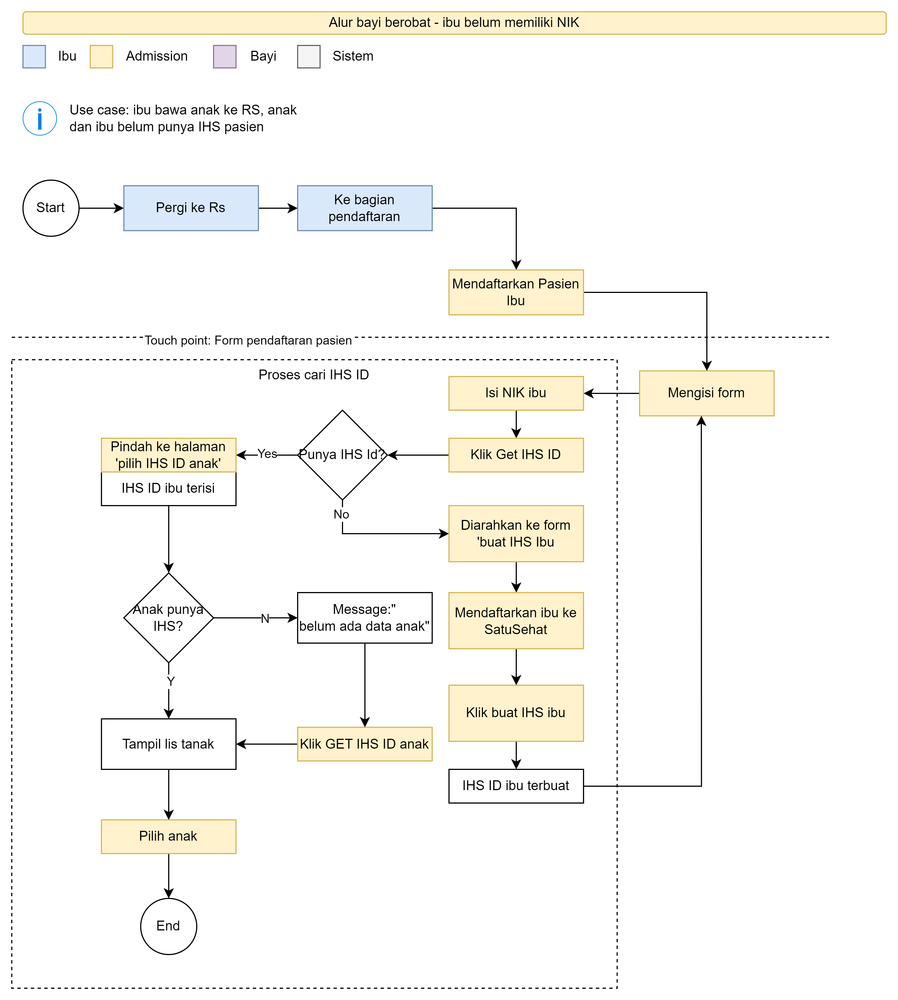{ width="600" }
  <figcaption>New born update data</figcaption>
</figure>

  [:octicons-arrow-right-24: New Born both none IHS](https://drive.google.com/file/d/1SXpzkvxoJsbfGCg5XaignZ1Mfn8VMk6U/view?usp=sharing){:target="_blank"}

This use case, is related to

[:octicons-arrow-right-24: VK registration](#){:target="_blank"}

[:octicons-arrow-right-24: OK registration](#){:target="_blank"}

[:octicons-arrow-right-24: EMR Pengkajian Bayi Baru Lahir](#){:target="_blank"}

[:octicons-arrow-right-24: Bayi encounter](#){:target="_blank"}

### Use Case 4: Foreign Patient Registration
:green_book:{ title="desain UI/UX sudah selesai" } :mango:{ title="feature development belum diujicoba" }

For accommodating foreign patient registration, the system accepts passport, KITAP, and KITAS. Different with local patient, foreign patient data doesn't submitted to SatuSehat. Instead, we only keep the foreign patient data inside our database.

<figure markdown>
  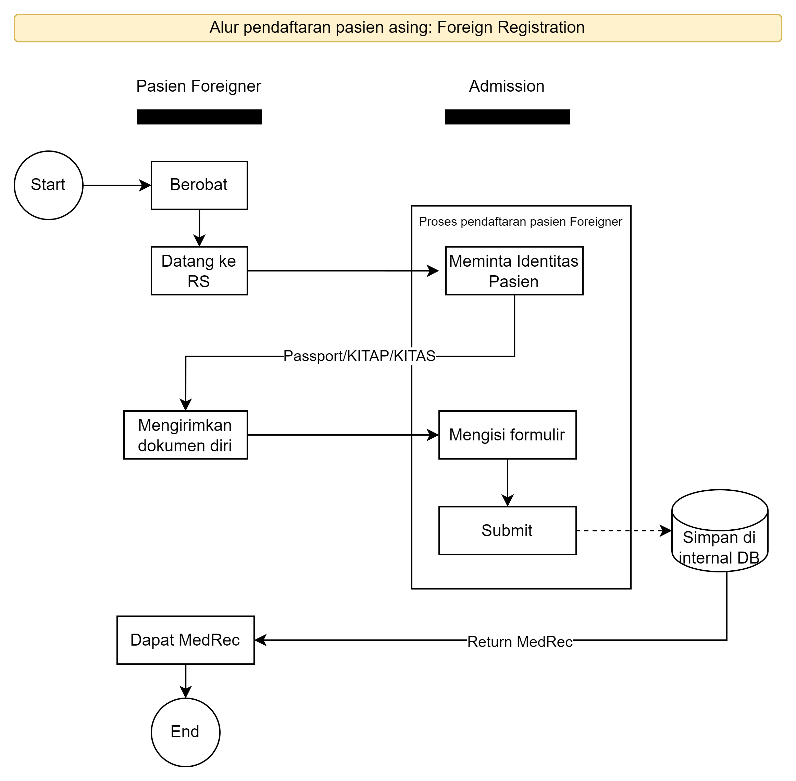{ width="600" }
  <figcaption>Foreign patient registration</figcaption>
</figure>

[:octicons-arrow-right-24: Foreign Patient Registration](https://drive.google.com/file/d/1QB4cLMzxE9dGAIeGQmvkqhUbBPuoqUYs/view?usp=sharing){:target="_blank"}

### Use Case 5: Patient X registration
:green_book:{ title="desain UI/UX sudah selesai" } :mango:{ title="feature development belum diujicoba" }

This scenario includes the situation in which a patient requiring emergency services, such as due to an accident. Thus, the system require to create a temporary MedRec (Medical Record).

Here is the flow of creating patient-X data.

<figure markdown>
  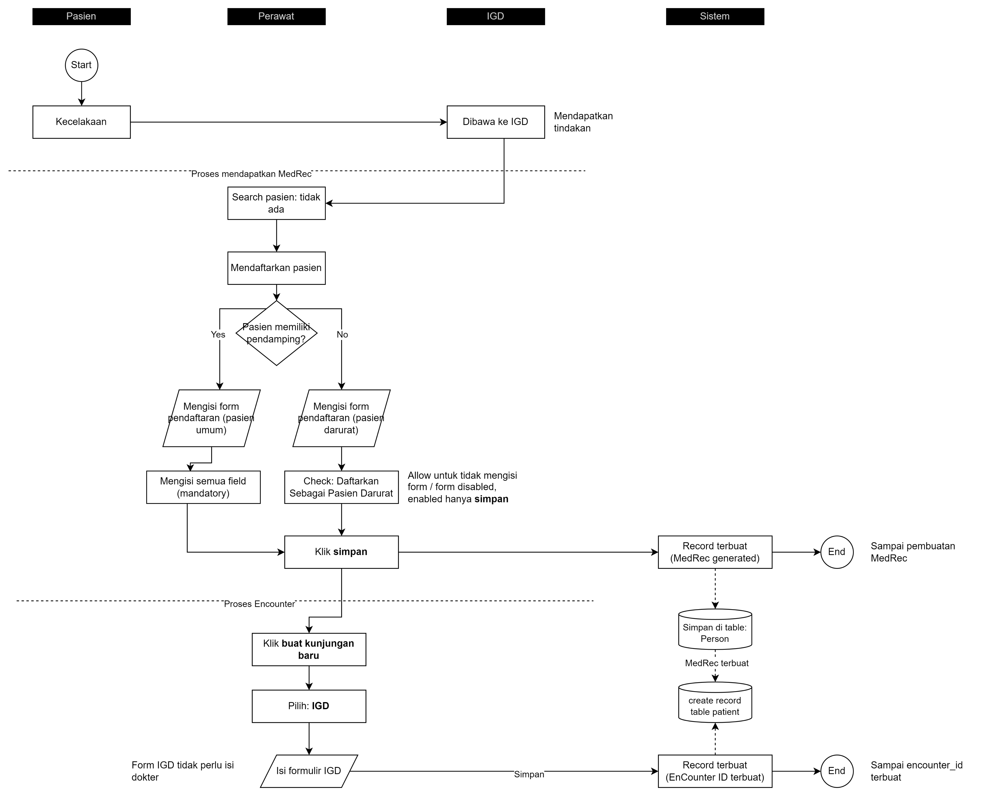{ width="600" }
  <figcaption>Patient X registration flow</figcaption>
</figure>

[:octicons-arrow-right-24: Patient X Registration](https://drive.google.com/file/d/11AP8QOKN5-ltQBrgLA_H30VufIrcU_xJ/view?usp=sharing){:target="_blank"}

Here is the flow of updating patient-X data.

<figure markdown>
  { width="600" }
  <figcaption>New Patient Registration (Offline-Admission)</figcaption>
</figure>

[:octicons-arrow-right-24: updating patient-X data](https://drive.google.com/file/d/1vKs14UPH3n6uTs1o6Gz-PekWIADWnEAz/view?usp=sharing)

## Sub-Scenario 1.2: Patient Tracking and Discharge (P2)

This sub-scenario involves overseeing and tracking the various interactions and healthcare procedures that patients undergo during their medical journey. This way, we can monitor the patient's status throughout their treatment at the hospital, from the moment they enter until discharge.

During this process, we classify patients into these use cases:

: !!! Example "Use Case List"

        1. [Use Case 1: Patient Tracking](#use-case-1-patient-tracking)
        2. [Use Case 2: Patient Discharge](#use-case-2-patient-discharge)

### Use Case 1: Patient Tracking
:green_book:{ title="desain UI/UX sudah selesai" } :mango:{ title="feature development belum diujicoba" }

We will prepare a single screen to monitor a patient's journey within the hospital. This includes outpatient, inpatient, medical check-up, emergency room (ER), and one-day care patients.

Here is the flow of patient tracking

<figure markdown>
  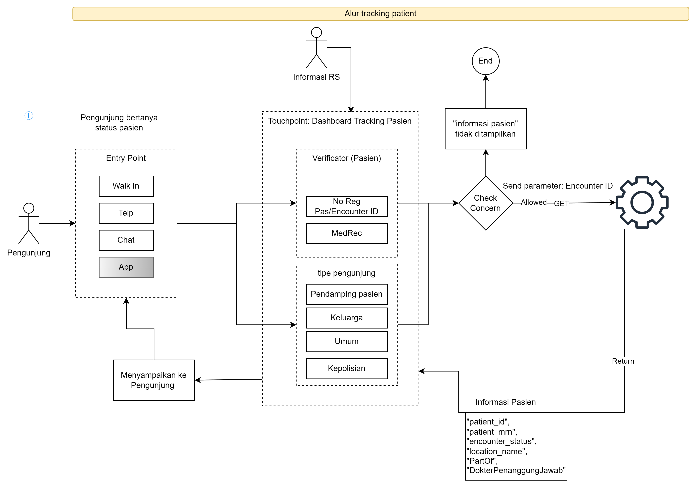{ width="600" }
  <figcaption>New Patient Registration (Offline-Admission)</figcaption>
</figure>

[:octicons-arrow-right-24: Patient Tracking](https://drive.google.com/file/d/1QLVIVreMOFK9O3hprX4--aNcXkwQ4PKw/view?usp=sharing){:target="_blank"}

### Use Case 2: Patient Discharge
:closed_book:{ title="desain UI/UX belum selesai; Secara tampilan List semua pasien, juga sudah terlihat statusnya sudah discharged atau belum. TODO: Flow detail ada di EMR" } :mango:{ title="feature development belum diujicoba" }

In the situation when a patient has received all the required medical services, we have a procedure for their discharge. A patient is eligible for discharge only after they have completed all necessary medical treatments, have received a recommendation from their doctor, and have settled and closed all their hospital bills.

<figure markdown>
  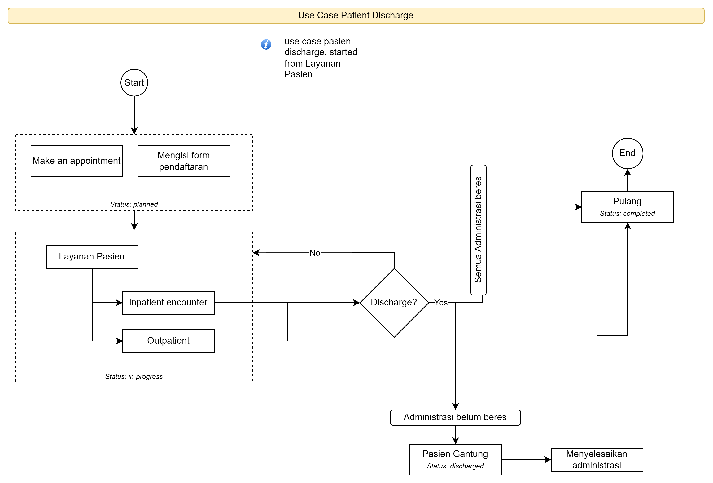{ width="600" }
  <figcaption>New Patient Registration (Offline-Admission)</figcaption>
</figure>

[:octicons-arrow-right-24: Patient Tracking](https://drive.google.com/file/d/1JK9YOR7uSG_iYr07lbDLiEvfNEHeJOSr/view?usp=sharing){:target="_blank"}

## Sub-Scenario 1.3: Patient Discharge Lead Time Reporting System (P3)
{==

PHASE 3

==}

To support our patient management scenario, we also enhance it with a patient discharge monitoring scenario using a reporting system. The presentation is in the form of a one-page patient discharge evaluation, equipped with data visualization capabilities based on filters by (specific criteria):

- Date range
- Registration type: outpatient, inpatient, emergency, one day care, medical checkup, and ancilliaries
- Total transaction (by quantity and by volume)
- Other additional criteria (*to be decided soon*)

: !!! Example "Use Case List"

        1. [Use Case 1: Patient Discharge Lead Time Report](#use-case-1-patient-discharge-lead-time-report)

### Use Case 1: Patient Discharge Lead Time Report
:mango:{ title="feature development belum diujicoba" }

{==

PHASE 3

==}

The use case details the entire patient journey, from the initial encounter to discharge, with a focus on time measurement. To enhance this, we plant to implement a dashboard designed to monitor and evaluate the lead time for each patient. This report classifies patients into two categories: outpatient and inpatient care.
