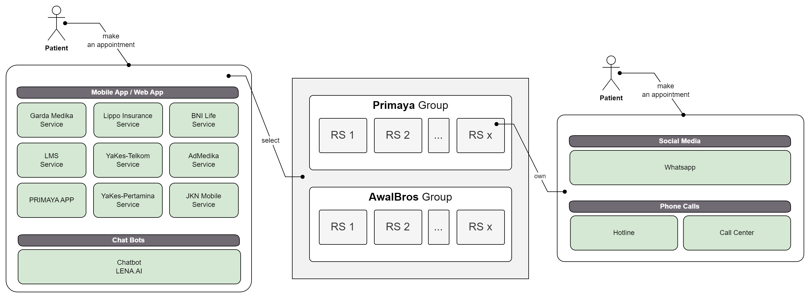
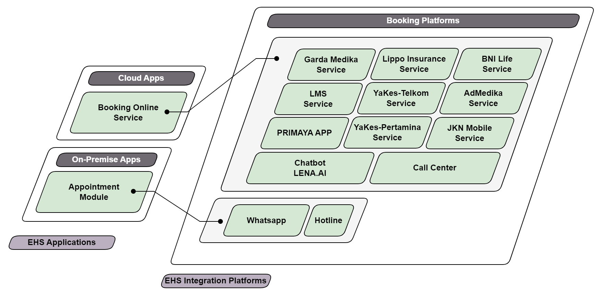
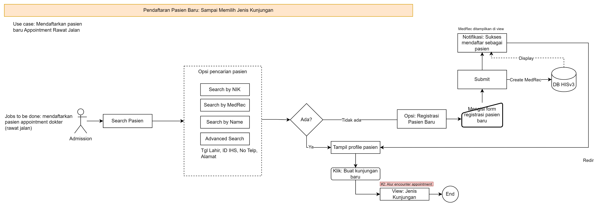
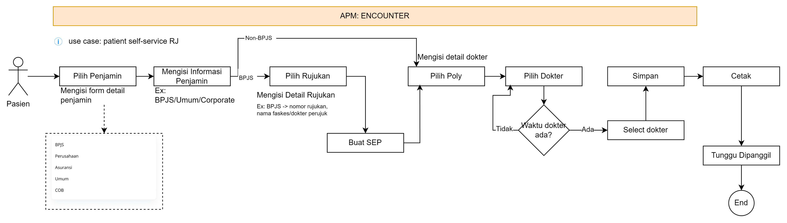
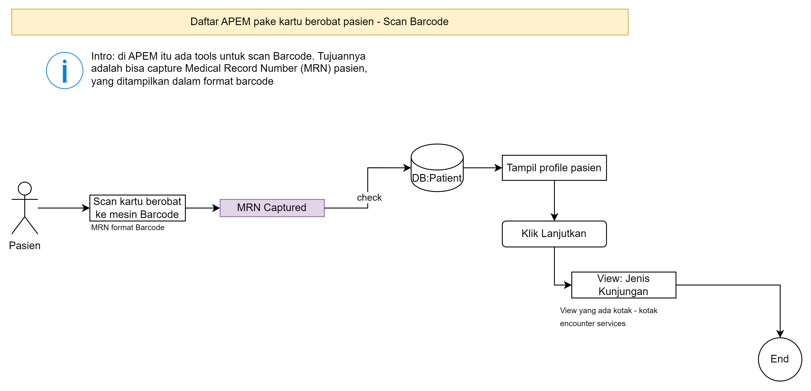

# Scenario 2: Appointment and Scheduling
The scenario focuses on a system designed to facilitate patient appointments through both online and offline methods, along with the capability for patients to check doctor availability by viewing their schedules.

: !!! Info "Sub-Scenario List"

        1. [Sub-Scenario 2.1: Appointment booking](#sub-scenario-31-appointment-booking)
        2. [Sub-Scenario 2.2: Teleconsultation Integration](#sub-scenario-32-teleconsultation-integration)

## Sub-Scenario 2.1: Appointment booking

This sub-scenario allows patients to book appointments in two ways: Online and Offline.

As a result of patient bookings, this process updates the doctor's dashboard with information about patients who have scheduled appointments where they can then view this patient list through the EMR (Electronic Medical Records) module for a docter access right.

: !!! Example "Use Case List"

        1. [Use Case 1: Online Appointment Booking](#use-case-1-online-appointment-booking)
        2. [Use Case 2: Offline Appointment Booking](#use-case-2-offline-appointment-booking)
        3. [Use Case 3: Patient Appointment Booking (Doctor Dashboard)](#use-case-3-patient-appointment-booking-doctor-dashboard)

Useful resources
[:octicons-arrow-right-24: Appointment flow refer to HISv2](https://drive.google.com/file/d/1IbvLqNKuBTXuXYieXmG_C3iqmPuFx7dQ/view?usp=sharing){:target="_blank"}

### Use Case 1: Online Appointment Booking

{==

TODO: ada penjelasan darimana sumber request booking berasal.

==}

<figure markdown>
  { width="600" }
  <figcaption>General Overview: Online Booking Request</figcaption>
</figure>

#### Connected 3rd party platforms

The mechanism for booking appointments through online channels
can be subjected as mobile apps (android/IoS), a web app, a chat Bot,
messaging apps (e.g. WhatsApp), Hotline, Call Center.

Below are the listed online channels can will be integrated into HIS v3.0 platform:

- Primaya App
- Garda Medika
- Lippo Insurance
- BNI Life
- JKN Mobile
- LMS
- YaKes-Telkom
- YaKes-Pertamina
- AdMedika

<figure markdown>
  { width="600" }
  <figcaption>How Online Appointment API manages appointment requests</figcaption>
</figure>

#### Online Booking Activity Procedures
{==

TODO: Dijelaskan prosedurnya gmn

==}

The onling booking is performed via four possible portals:
(1) through [3rd party Apps]
(2) through social media
(3) through phone call

  [3rd party Apps]: #connected-3rd-party-platforms

<figure markdown>
  { width="600" }
  <figcaption>Online appointment general procedure</figcaption>
</figure>

[:octicons-arrow-right-24: Online appointment general procedure](https://drive.google.com/file/d/1EPspMsJJdZy7Vd78CFUcw2B0nwzPOFyv/view?usp=sharing){:target="_blank"}

### Use Case 2: Offline Appointment Booking

In the appointment booking scenario where patients visit Primaya Hospital directly, a form called the encounter form is provided. This encounter form is used by the Admission team when registering patients, and by the *Anjungan Pendaftaran Mandiri (APM)* to facilitate patients in making on-site, self-managed bookings through the *Anjungan*.

#### Appointment Booking (helped by Admission)

Here is the flow of offline appointment booking with the help of admission

<figure markdown>
  { width="600" }
  <figcaption>Offline/walk in new patient registration</figcaption>
</figure>

<figure markdown>
  { width="600" }
  <figcaption>Offline/walk in encounter with doctor appointment</figcaption>
</figure>

[:octicons-arrow-right-24: APEM register new patient](https://drive.google.com/file/d/1nCA9ZUnVvvkHHmNXHWtRN4e6LvOTjhmU/view?usp=sharing){:target="_blank"}

#### Appointment Booking with APEM - Fill NIK

Here is the flow of offline appointment booking with self-managed (faciliated with Anjungan Pendaftaran Mandiri/APEM)

<figure markdown>
  { width="600" }
  <figcaption>Offline/walk in new patient registration</figcaption>
</figure>

<figure markdown>
  { width="600" }
  <figcaption>Offline/walk in encounter with doctor appointment</figcaption>
</figure>

[:octicons-arrow-right-24: APEM register new patient](https://drive.google.com/file/d/1nCA9ZUnVvvkHHmNXHWtRN4e6LvOTjhmU/view?usp=sharing){:target="_blank"}

For this MVP phase, APEM only serves the outpatient registration.

Other flow references

[:octicons-arrow-right-24: Skenario send NIK to SatuSehat](https://drive.google.com/file/d/1UCzbmMiQ8Rz5PtmUhMBFji_hHg54Aec0/view?usp=sharing){:target="_blank"}

#### Appointment Booking with APEM - Scan MRN Barcode
This scenario describes the APEM (Anjungan Pendaftaran Mandiri) for patient that want to do encounter by using their medical card. In this case, the system will capture the MRN (medical record number) then identified the patient before continuing to the encounter process. 

<figure markdown>
  { width="600" }
  <figcaption>Offline/walk-in encounter scan barcode </figcaption>
</figure>

[:octicons-arrow-right-24: Walk in Encounter Scan Barcode](https://drive.google.com/file/d/1g1RELx2gcRxp371wW9DO-ffvWlX2omw2/view?usp=sharing){:target="_blank"}

Things to note for this process:

- Only patient that register with BPJS as the payor (both only BPJS or cost-share with other payor), then there should be followed by the process of filing referrence (Rujukan)
- Else, is optional to fill the referrence (rujukan)
- The SEP (Surat Eligibilitas Peserta) should be created every single encounter visit. 
- It is possible for one encounter to have multiple referrence (represented by referral number). One referral number is typically used by one `encounter_id` 

### Use Case 3: Patient Appointment Booking (Doctor Dashboard)

Every successful appointment booking made by a patient will then be recorded in the system, scheduling the patient to meet the doctor. The respective doctor will be able to view the schedule of patients who have made appointments through the Doctor's EMR Dashboard.

Here the ideation is, we will build the view for both two personas (Doctor and Nurse) to monitor the patient who have made the appointment, that then doctor can filter-in/filter-out patient that they will proceed.

Ideation reference:

[:octicons-arrow-right-24: Doctor view of patient appointment list - ideaiton](https://drive.google.com/file/d/1QMmq0Aqh0t9DYLMUJSWzHajj0J3gBMIS/view?usp=sharing){:target="_blank"} 

Here is the proposed use cases:

<figure markdown>
  { width="600" }
  <figcaption>Offline/walk in encounter with doctor appointment</figcaption>
</figure>

[:octicons-arrow-right-24: APEM register new patient](https://drive.google.com/file/d/1nCA9ZUnVvvkHHmNXHWtRN4e6LvOTjhmU/view?usp=sharing){:target="_blank"}

## Sub-Scenario 2.2: Teleconsultation Integration

Furthermore, there is a mechanism that allows patients to check the availability of the doctor with whom they wish to make an appointment. This could involve real-time updates on the doctor's schedule, accessible through the same channels used for booking appointments.

: !!! Example "Use Case List"

        1. [Use Case 1: API integration ](#use-case-1-api-integration)

### Use Case 1: API integration

{==

TO DO: USE CASE DIAGRAM

==}

API integration is provided to accommodate third-party integrations, which we classify as __[Online Booking channels]__.

To complete this scenario, we offer endpoints for online appointment booking through API integration. As a result, the online registration process takes place outside the HISv3 environment.

  [Online Booking channels]: #use-case-1-online-appointment-booking

The channels that are scheduled to be integrated with HIS v3 include:

- Chatbot
- Social Media: Instagram & Facebook
- Website
- Primaya App

