# Scenario 3: Patient Encounter

The "encounter phase" refers to the stage where a patient arrives for a clinic visit. In this phase, our system facilitates a variety of use cases that a patient may undergo, including: outpatient registration, emergency department registration, medical check-up registration, and support services registration.

We develop the HISv3 according to the FHIR standards. See the use cases below from SatuSehat as the reference

[:octicons-arrow-right-24: Encounter use cases - ref SatuSehat](https://drive.google.com/file/d/14KTUTHaVQ2VFxaS4_W4vUW4MnE3aEvBB/view?usp=sharing){:target="_blank"}

Additionally, for for encounter services, it involves selecting the class, type of service, and doctor. It also encompasses the cancellation of registrations or transactions and the creation of patient transaction reports.

: !!! Info "Sub-Scenario List"

        1. [Sub-Scenario 3.1: Outpatient Encounter Information System](#use-case-1-outpatient-encounter-based-on-patient-registration-status)
        2. [Sub-Scenario 3.2: Emergency Encounter Information System](#sub-scenario-22-emergency-encounter-information-system)
        3. [Sub-Scenario 3.3: MCU Encounter Information System](#sub-scenario-23-mcu-encounter-information-system)
        4. [Sub-Scenario 3.4: Outpatient Encounter Information System](#sub-scenario-24-ancillary-service-encounter-information-system)
        5. [Sub-Scenario 3.5: Emergency Encounter Information System](#sub-scenario-25-inpatient-encounter-information-system)
        6. [Sub-Scenario 3.6: MCU Encounter Information System](#sub-scenario-26-encounter-cancellation)
        7. [Sub-Scenario 3.7: Encounter Reporting System](#sub-scenario-27-encounter-reporting-system)

## Sub-Scenario 3.1: Outpatient Encounter Information System
This sub-scenario explains the registration process for outpatient visits. The scope covered here includes the patient registration types, chosen payors, selected polys and doctors, as well as interoperabili
ty with 'services' and 'electronic medical record' modules.

: !!! Example "Use Cases List"

        1. [Use Case 1: Outpatient Encounter Based On Medical Record Number (MRN)](#use-case-1-outpatient-encounter-based-on-medical-record-number)
        2. [Use Case 2: Payor Selection](#use-case-2-payor-selection)
        3. [Use Case 3: Poly Selection](#use-case-3-poly-selection)
        4. [Use Case 4: Dispenser Package Selection](#use-case-4-dispenser-package)
        5. [Use Case 5: Admission put additional information to the patient](#use-case-5-additional-information)

### Use Case 1: Outpatient Encounter Based On Medical Record Number

There are two MRN classifications that is used by the patient during their encounter

- Patient encounter with Permanent MRN:
    This patient encounter will be treated as a common patient, where all of their encounter activities are tied up with the MRN. Thus, every process produced by this patient will update patient journey that tied up with `patient` table.

     <figure markdown>
        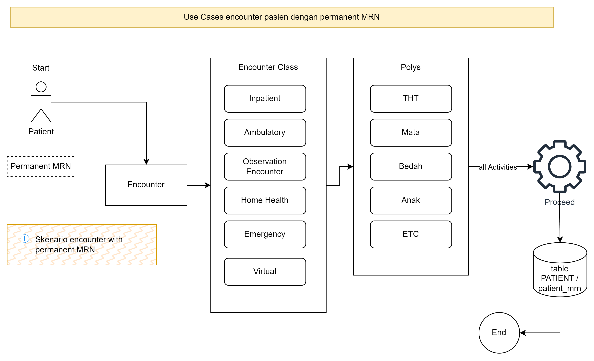{ width="600" }
        <figcaption>Patient encounter with Permanent MRN</figcaption>
     </figure>

Other useful flow:

| Flow                                              | Link                                                                                                                                         |
|---------------------------------------------------|----------------------------------------------------------------------------------------------------------------------------------------------|
| MR.X Patient Update Flow                          | [:octicons-arrow-right-24: Click here](https://drive.google.com/file/d/1vKs14UPH3n6uTs1o6Gz-PekWIADWnEAz/view?usp=sharing){:target="_blank"} |
| Use case Mr.X accident go to emergency            | [:octicons-arrow-right-24: Click here](https://drive.google.com/file/d/1h1X92Oku2qfrmRpmPWsd69_nJYLDxbxQ/view?usp=sharing){:target="_blank"} |
| Patient X Registration - current UI/UX referrence | [:octicons-arrow-right-24: Click here](https://drive.google.com/file/d/11AP8QOKN5-ltQBrgLA_H30VufIrcU_xJ/view?usp=sharing){:target="_blank"} |

- Patient encounter with Temporary MRN:
    The temporary MRN will be applied to patient with unidentified profile (like __[Patient X]__). The process is whenever this patient experiences encounter activities, it will update the encounter activities tied up with the `MRN table`. Once the patient is transferred to the existing MRN, the following information will be migrated to the referred MRN and this MRN will be nullified.

    Below is the use case

: <figure markdown>
          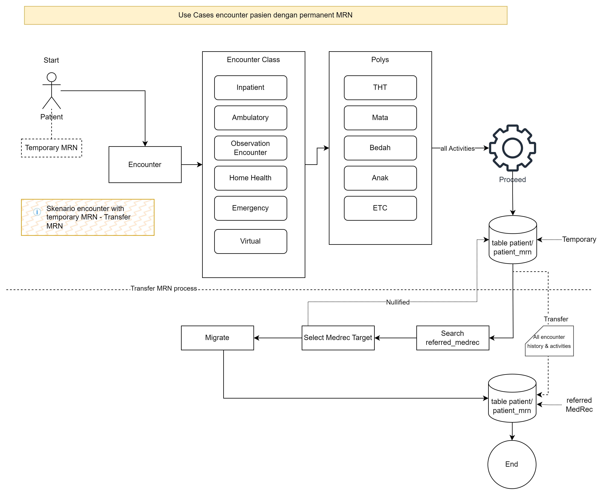{ width="600" }
          <figcaption>Patient encounter with temporary MRN</figcaption>
  </figure>

[:octicons-arrow-right-24: Patient encounter with temporary MRN](https://drive.google.com/file/d/1M_i8SVnqKNRNLTz5rRaWrZi9YRkXrYDD/view?usp=sharing){:target="_blank"}

### Use Case 2: Payor Selection

The **Payor** referred to here are institutions or individuals registered to cover the cost of a patient's medical services. The payors that can be registered in this system include: general, corporate, and insurance.

: <figure markdown>
        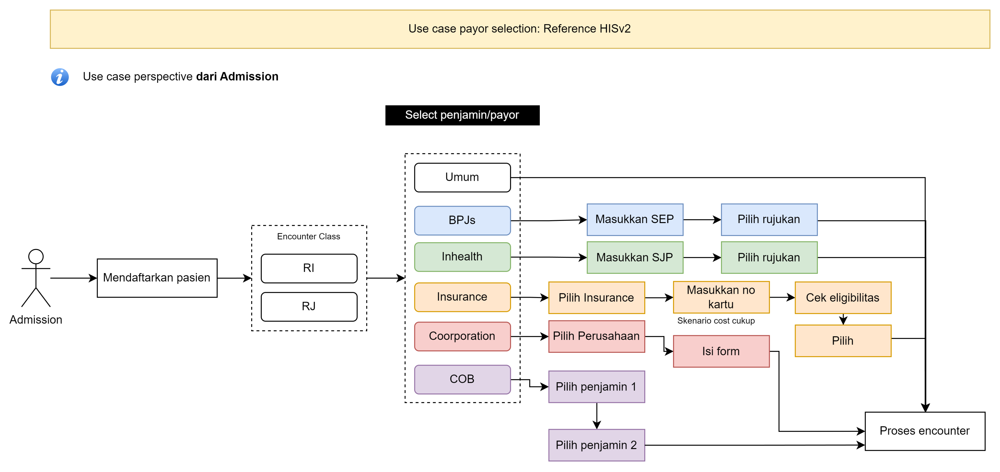{ width="600" }
        <figcaption>Use Case Payor Selection - High Level </figcaption>
</figure>

[:octicons-arrow-right-24: Patient Tracking](https://drive.google.com/file/d/1OOtLggz5ogL-22_EVnQaFA4b6t6myQX_/view?usp=sharing){:target="_blank"}

For insurance, there are two types displayed: payors that have undergone an integration process (bridging system) with the Hospital Information System (HIS), and payors that are manually entered.

For those that are integrated, according to HISv2, they include:

- BPJS
    When selecting BPJS, the admission require SEP (Surat Eligibilitas Peserta) from patient to show is there any referral for treatment to the hospital. This scenario allow patient to do cost share with BPJS.

- Inhealth
    When selecting Inhealth, the admission require SJP (Surat Eligibilitas Peserta) from patient to show is there any referral for treatment to the hospital. This scenario allow patient to do cost share with BPJS.

The other payor that possible to select are:
- Corporation
- Private Insurance
- General
- Cost-share (between two payors)

The selection of these integrated payors complies with policies such as:

- Policy of Cooperation of Benefit (COB)
- Policy on choosing clinics and the maximum payment limit by the guarantor
- Policy on the settlement/billing process to the guarantor

Below is the use case of payor selection

#### Encounter with BPJS selected

:    <figure markdown>
        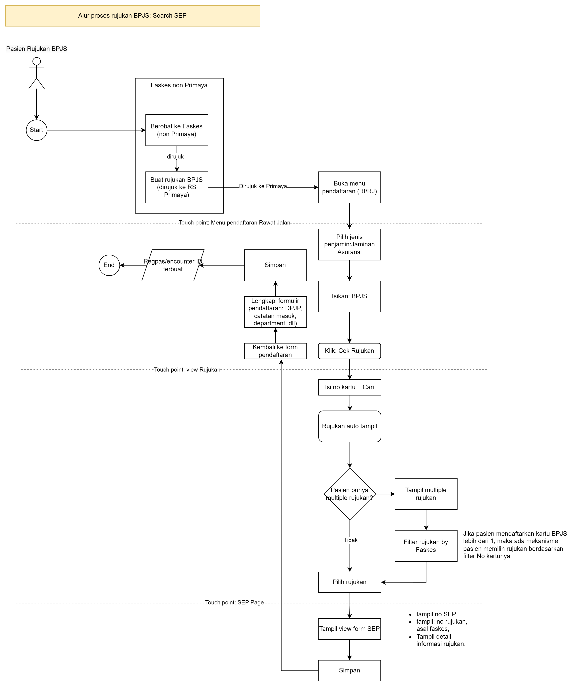{ width="600" }
        <figcaption>Encounter with BPJS Selected</figcaption>
     </figure>

[:octicons-arrow-right-24: Encounter with BPJS selected](https://drive.google.com/file/d/18W4eIzPYdrqiy6tpxzjebrjQ6i9HlamO/view?usp=sharing){:target="_blank"}

### Use Case 3: Poly Selection

During the registration process, there's a requirement to choose a clinic (Poly), and some specifications when selecting a clinic are as follows:

- Choosing a poly will entail selecting the doctors registered at that poly along with their available schedules.
- For non-emergency department clinics, appointments can be scheduled for future dates according to the doctor’s schedule availability.
- For the Emergency Department (IGD) clinic, it can only be selected for immediate selection.
- For the Medical Check-Up (MCU) clinic, there is an option to register collectively, with the healthcare service options that can be extended to patient sites.

!!! Note

    To enable the selection of a clinic and doctor, a scenario for registering clinics and doctors in the master module is necessary.

Below is the use case of poly selection

: <figure markdown>
        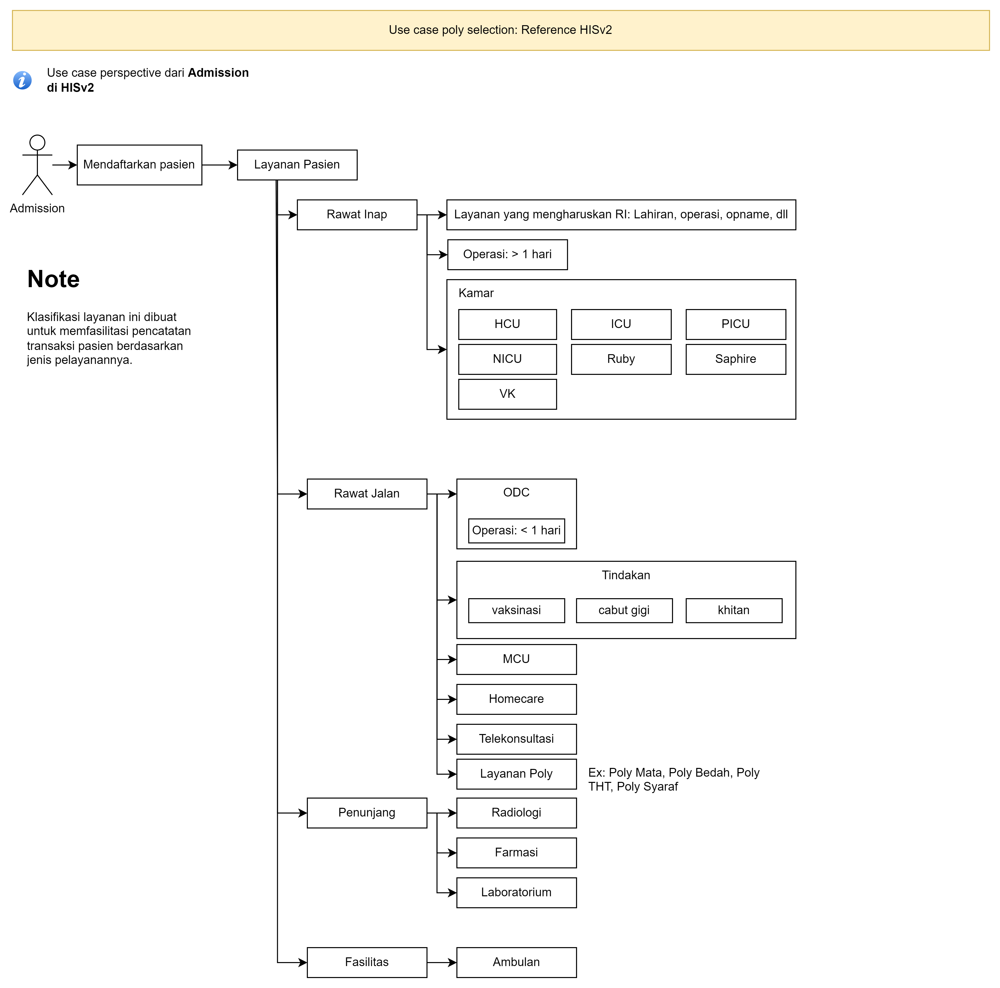{ width="600" }
        <figcaption>Poly usse cases - reference from HISv2</figcaption>
</figure>

[:octicons-arrow-right-24: Encounter with BPJS selected](https://drive.google.com/file/d/18W4eIzPYdrqiy6tpxzjebrjQ6i9HlamO/view?usp=sharing){:target="_blank"}

#### Encounter Status Definition

For the service request status, we map it baed on [FHIR: value set service request status](https://build.fhir.org/valueset-request-status.html){:target="_blank"}. So here are the list of service request status that we are going to use:

| Status   | Description                  |
| ----------- | ------------------------------------ |
| `draft`     | The request has been created but is not yet complete or ready for action. |
| `active`       | The request is in force and ready to be acted upon.|
| `on-hold`  | 	The request (and any implicit authorization to act) has been temporarily withdrawn but is expected to resume in the future. |
| `completed`  | The activity described by the request has been fully performed. No further activity will occur. |

For the encounter status, we map it baed on [FHIR: value set encounter status](https://build.fhir.org/valueset-encounter-status.html){:target="_blank"}. So here are the list of encounter status that we are going to use:

| Status   | Description                  |
| ----------- | ------------------------------------ |
| `planned`     | 	The Encounter has not yet started |
| `in-progress`       | The Encounter has begun and the patient is present / the practitioner and the patient are meeting.|
| `on-hold`  | The Encounter has begun, but is currently on hold, e.g. because the patient is temporarily on leave. |
| `Cancelled`  | The Encounter has ended before it has begun|
| `Completed`  | The Encounter has ended  |

According to FHIR, we classify the services as described in the use cases below

Below is the use case of poly selection

: <figure markdown>
        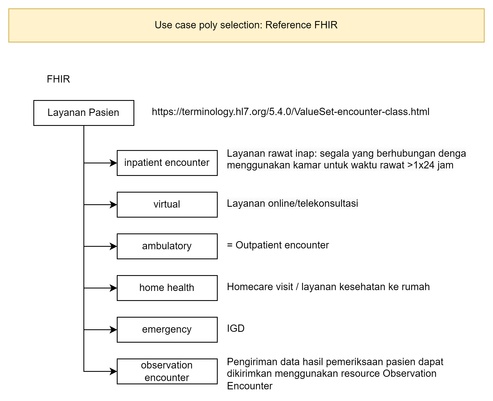{ width="600" }
        <figcaption>Poly usse cases - reference FHIR</figcaption>
</figure>

[:octicons-arrow-right-24: Encounter with BPJS selected](https://drive.google.com/file/d/1eiwS4rZTJVPOxENn1fuLmH4qBu14I7Mv/view?usp=sharing){:target="_blank"}

### Use Case 4: Package Selection

There are three types of package that can be selected by the patient during their encounter:

- Dispenser package

{==

TO DO: PHASE 3

==}

The dispenser package enables patients to select packages as bundles. It behaves as a unity packages in which each of the item inside the package can't be cancelled. Some of the bundle scenarios available here include:

    - Bundles of different services from the same clinic or different clinics
    - Bundles incorporating other support services such as pharmacy, radiology, or laboratory
    - Options for multiple visit encounters.

- Profile package

{==

TO DO: USE CASE DIAGRAM

==}

- Panel package

Useful resources:

[:octicons-arrow-right-24: User Manual Dispenser Package](https://drive.google.com/file/d/1R58VzRovwjbHx6qbJw9GE3c-KckSSJTz/view?usp=sharing){:target="_blank"}

### Use Case 5: Additional Information

The scope here allows for the early identification of patients by looking at the admission notes that can be filled out by a nurse.

According to HISv2, there are three types of early identification patients:

- Flag of Chronic Patient
- Flag of Pasien Rujuk Balik (PRB)
- Common patient (no flag)

These admission notes will then be received by both the Nurse and the Doctor on the Electronic Medical Record (EMR) module.

Below is the use of additional information:

: <figure markdown>
        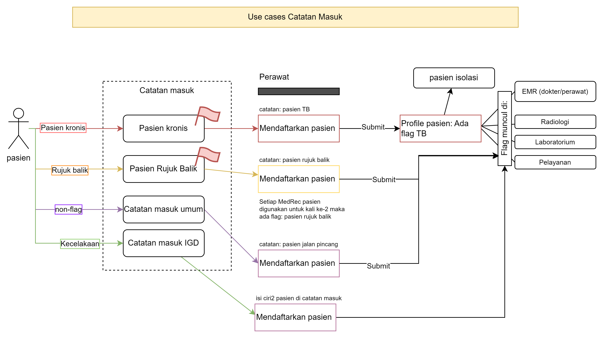{ width="600" }
        <figcaption>Poly usse cases - reference FHIR</figcaption>
</figure>

[:octicons-arrow-right-24: Encounter with BPJS selected](https://drive.google.com/file/d/1T4iIML-81UR8XuWGR-f-cAokiiJV7Q94/view?usp=sharing){:target="_blank"}

## Sub-Scenario 3.2: Emergency Encounter Information System
This scenario explain how HISv3 treat the patient for emergency encounter.

: !!! Example "Use Cases List"

        1. [Use Case 1: Emergency Encounter](#emergency-encounter-admission)

### Use Case 1: Emergency Encounter Admission

: <figure markdown>
        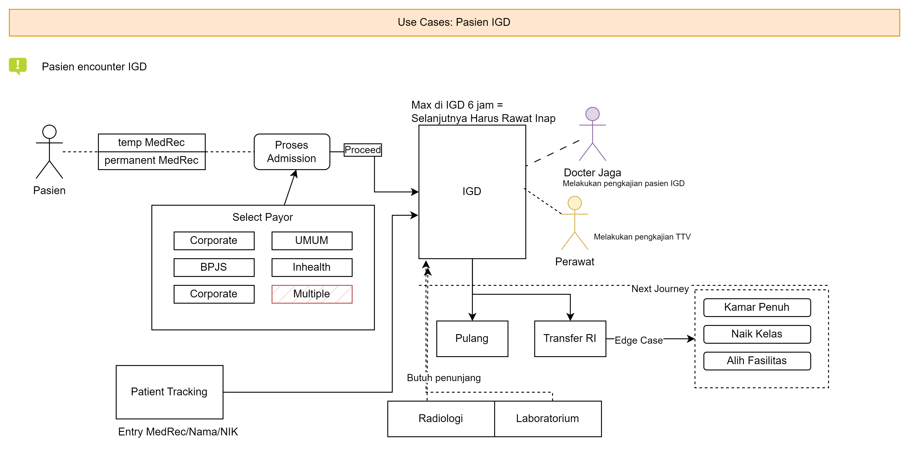{ width="600" }
        <figcaption>Emergency use cases</figcaption>
</figure>

[:octicons-arrow-right-24: emergency encounter admission](https://drive.google.com/file/d/101dZ06AOjzUqdiESAaSl-OUjUIQwT6hy/view?usp=sharing){:target="_blank"}

## Sub-Scenario 3.3: MCU Encounter Information System

: !!! Example "Use Cases List"

        1. [Use case 1: MCU Encounter Status](#use-case-1-mcu-encounter-status)
        2. [Use case 2: MCU Encounter - Patient completed the MCU items](#use-case-2-mcu-encounter---patient-completed-the-mcu-items)
        3. [Use case 3: MCU Encounter - Patient discompleted the MCU items](#use-case-3-mcu-encounter---patient-discompleted-the-mcu-items)
        4. [Use case 4: MCU Encounter - Patient reschedule the MCU items](#use-case-4-dispenser-package)
        5. [Use case 5: MCU Encounter - MCU Onsite](#use-case-5-additional-information)

### Use case 1: MCU Required Status
According to the __[Encounter Status Definition]__ There are two status type used in the correlation of Medical Check Up: Service Request Status & Encounter Status.
: <figure markdown>
    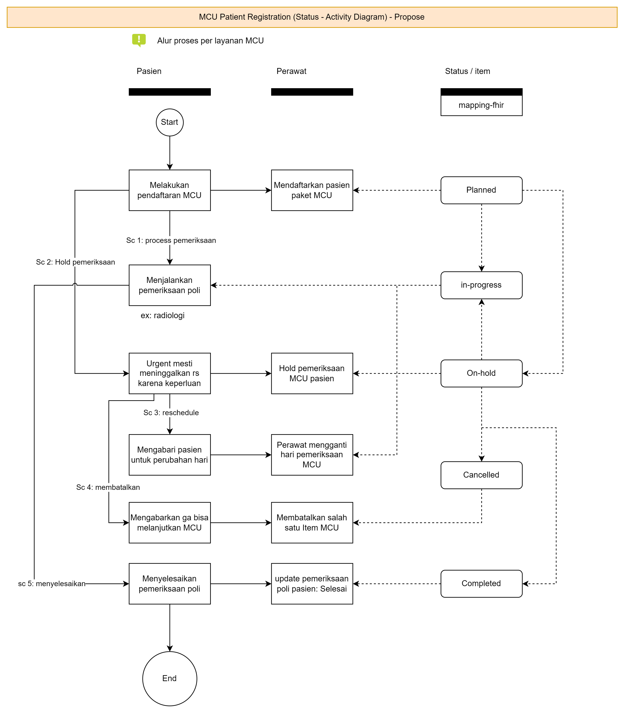{ width="600" }
    <figcaption>MCU encounter status diagram</figcaption>
  </figure>

[:octicons-arrow-right-24: MCU encounter status diagram](https://drive.google.com/file/d/1FRhHANeK2zC0vdPUWUmN7qTpWp5_tOaV/view?usp=sharing){:target="_blank"}

### Use case 2: MCU Encounter - Patient completed the MCU items
This use case explains the scenario of a patient completing all the items in the MCU series

: <figure markdown>
    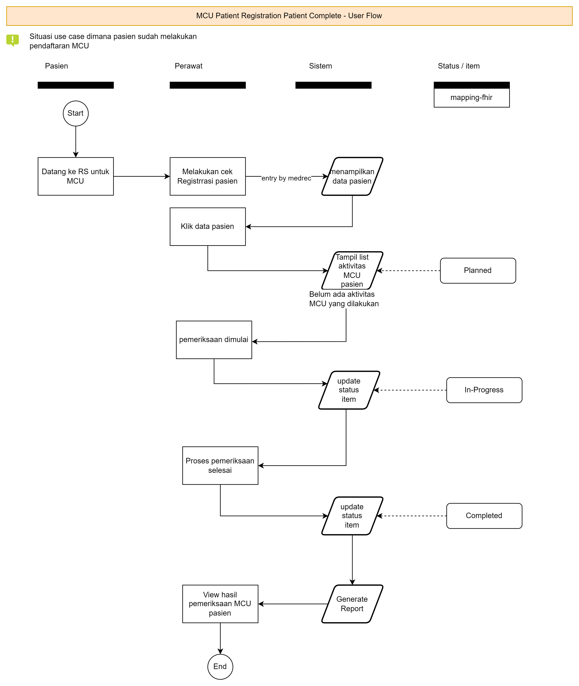{ width="600" }
    <figcaption>MCU encounter status diagram</figcaption>
  </figure>

[:octicons-arrow-right-24: MCU encounter - patient completed the MCU series](https://drive.google.com/file/d/1OheUfVhGxkxtOQS0ij2vM8r30-Xzw9nq/view?usp=drive_link){:target="_blank"}

### Use case 3: MCU Encounter - Patient discompleted the MCU items
This use case explains the scenario of a patient discomple some of the items in the MCU series

: <figure markdown>
    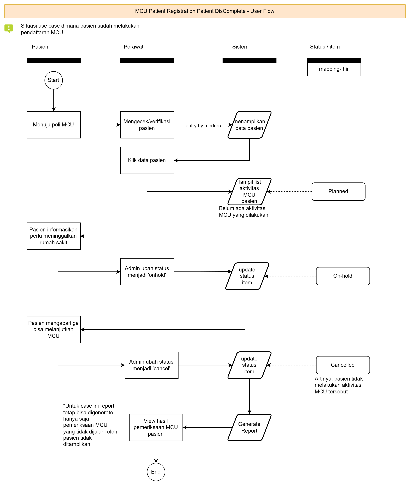{ width="600" }
    <figcaption>MCU encounter status diagram</figcaption>
  </figure>

[:octicons-arrow-right-24: MCU encounter - patient discimpleted the MCU series](https://drive.google.com/file/d/1Xam9hqU3CSq59bS786CUli3txV0HSnCm/view?usp=drive_link){:target="_blank"}

### Use case 4: MCU Encounter - Patient re-scheduled the MCU items
This use case explains the scenario of a patient rescheduling some of the items in the MCU series

: <figure markdown>
    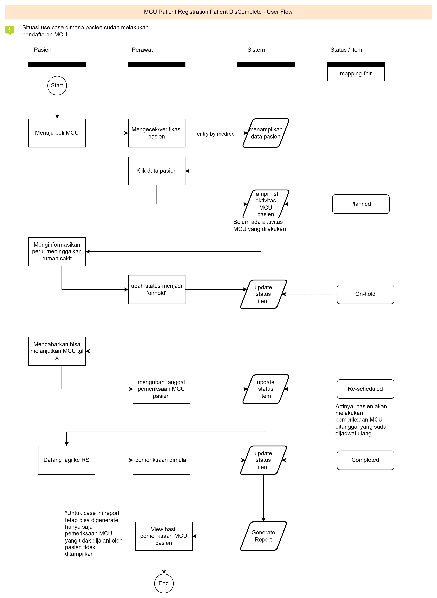{ width="600" }
    <figcaption>MCU encounter status diagram</figcaption>
  </figure>

[:octicons-arrow-right-24: MCU encounter - patient re-scheduled the MCU series](https://drive.google.com/file/d/1PZ6sOmSsBJ61ClYEylEQgwrtkfsEqTEK/view?usp=drive_link){:target="_blank"}

## Sub-Scenario 3.4: Ancillary Service Encounter Information System

: !!! Example "Use Cases List"

        1. [Use Case 1: Laboratorium encounter](#use-case-1-register-laboratorium){:target="_blank"}
        1. [Use Case 2: Radiologi encounter](#use-case-2-register-radiologi){:target="_blank"}

### Use-case 1: Register Laboratorium 
The laboratorium registration is described as in follow:

<figure markdown>
  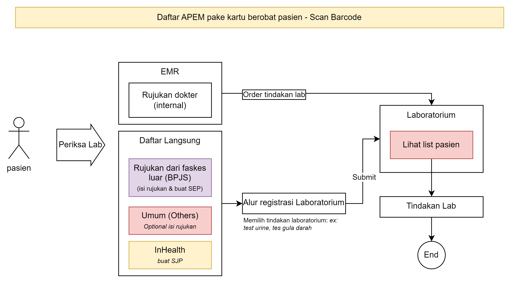{ width="600" }
  <figcaption>Lab registration use case</figcaption>
</figure>

[:octicons-arrow-right-24: Lab registration use case](https://drive.google.com/file/d/1eQfWyCupiZ5YVOi6EziM1L9jZ6SODOKG/view?usp=sharing){:target="_blank"}

### Use-case 2: Register Radiologi

{==

TO DO: USE CASE DIAGRAM

==}

## Sub-Scenario 3.5: Inpatient Encounter Information System

Inpatient use case is described as the flow below:

<figure markdown>
  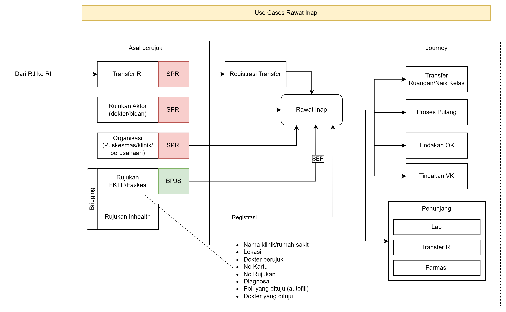{ width="600" }
  <figcaption>Inpatient Use Case</figcaption>
</figure>

[:octicons-arrow-right-24: Inpatient Use Case](https://drive.google.com/file/d/1M7UamFoNC5aW_rr8pYD43Yw8XOs6pxGu/view?usp=sharing){:target="_blank"}

: !!! Example "Use Cases List"

        1. [Use Case 1: #](#)

{==

TO DO: USE CASE DIAGRAM

==}

## Sub-Scenario 3.6: Encounter Cancellation

: !!! Example "Use Cases List"

        1. [Use Case 1: #](#)

{==

TO DO: USE CASE DIAGRAM

==}

## Sub-Scenario 3.7: Encounter Reporting System

: !!! Example "Use Cases List"

        1. [Use Case 1: #](#)

{==

TO DO: USE CASE DIAGRAM

==}

  [Patient X]: sc-1-patient-management.md#use-case-5-patient-x-registration
  [Encounter Status Definition]: #encounter-status-definition
